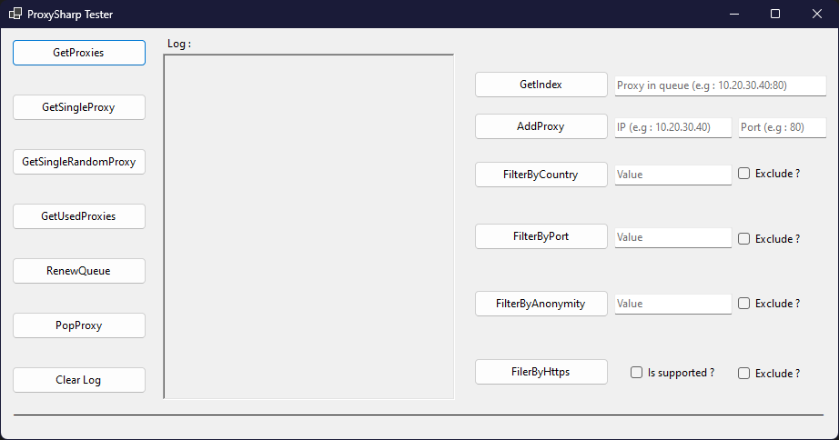

# ProxySharpTester

  Windows forms application to test ProxySharp ongoing developpement.

  

---
## Functions
- `GetProxies` : Show in log the list of proxies that are currently in the queue.
- `GetSingleProxy` : Show in log a single proxy from the queue.
- `GetSingleRandomProxy` : Show in log a single randomly choosed proxy from the queue.
- `GetUsedProxies` :  Show in log a list of previously used proxies. The lower the index, the older the proxy.
- `RenewQueue` : Clears the queue then adds a fresh list of proxies to the queue.
- `RenewFilteredProxies` : Clears the queue, then adds a fresh, filtered list of proxies based on the specified type filter. Allows filtering by or excluding.
- `GetIndex` : Gets the index of a proxy.
- `AddProxy` : Adds the specified proxy to the queue.
- `PopProxy` : Removes the first proxy in the queue.
## Dependencies
- [ProxySharp](https://github.com/m-henderson/ProxySharp) [based on latest dev branch build or master]
## Contributor Community
- [ProxySharp Discord](https://discord.gg/F77g42ZNFa)
